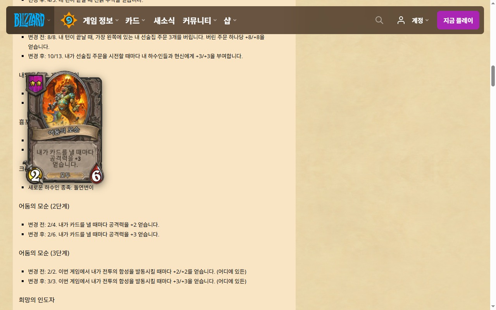

# 카드 호버 for 하스스톤

하스스톤 패치 노트를 읽을 때 카드 이름에 마우스를 올리면 카드 이미지를 띄워 주는 크롬 확장 프로그램입니다.

공식 패치 노트에는 전장 하수인이나 장신구가 이름만 적혀 있는 경우가 많습니다. 뭐였는지 기억이 안 나면 매번 검색해야 해서 만들었습니다.

## 설치

### 크롬 웹 스토어

심사 중입니다. 통과하면 여기에 링크를 올리겠습니다.

### 직접 설치

스토어를 거치지 않고 바로 쓰는 방법입니다.

1. 이 저장소를 내려받습니다. 오른쪽 위 `Code` → `Download ZIP`으로 받아 압축을 풀거나 `git clone` 합니다.
2. 크롬 주소창에 `chrome://extensions`를 입력합니다.
3. 오른쪽 위 **개발자 모드**를 켭니다.
4. **압축해제된 확장 프로그램을 로드합니다**를 누르고, `manifest.json`이 들어 있는 폴더를 선택합니다.

엣지, 웨일, 브레이브처럼 크로미움 기반 브라우저에서도 같은 방법으로 됩니다.

## 사용법

[하스스톤 공식 사이트](https://hearthstone.blizzard.com/ko-kr/news)에서는 설치만 하면 됩니다. 패치 노트를 열고 카드 이름에 마우스를 올리세요.

다른 사이트에서 쓰려면:

1. 그 사이트를 연 상태에서 주소창 옆 확장 프로그램 아이콘을 누릅니다.
2. **이 사이트에서 사용**을 체크합니다.
3. 크롬이 해당 사이트 접근을 허용할지 묻습니다. 허용하면 새로고침 없이 바로 동작합니다.

체크를 해제하면 그 사이트에서는 다시 꺼집니다.

알아 두면 좋은 것:

- 정규전·야생 카드, 전장 하수인, 선술집 주문, 장신구, 영웅, 이변을 인식합니다.
- "진흙 부식을 얻습니다"처럼 문장 중간에 나오는 이름도 인식합니다.
- 이름이 같은 카드가 여러 장이면 최대 4장까지 나란히 보여 줍니다. 이름 뒤에 `(2단계)`처럼 적혀 있으면 그 단계 카드만 나옵니다.
- 카드 데이터는 하루에 한 번 갱신됩니다. 패치 직후 새 카드가 안 뜨면 팝업의 **카드 데이터 새로고침**을 눌러 보세요.

## 안 되는 것

- 한글 카드 이름만 지원합니다.
- 이름 중간에 굵은 글씨나 링크가 걸려 있으면 인식하지 못합니다.
- 패치 직후에는 HearthstoneJSON에 이미지가 올라오기 전이라 카드가 안 뜰 수 있습니다.

## 동작 방식

페이지를 미리 훑어서 고치지 않습니다. 마우스가 멈춘 위치의 글자 주변 텍스트를 읽고, 그 글자를 포함하는 가장 긴 카드 이름을 찾습니다. 페이지 구조와 상관없이 동작하고 사이트를 건드리지 않는 대신, 호버할 수 있는 이름에 밑줄 같은 표시는 없습니다.

- `src/content/content.js` — 마우스 아래 글자를 찾고 툴팁을 그립니다.
- `src/background/card_matcher.js` — 카드 이름 인덱스를 만들고 이름을 찾는 순수 함수입니다.
- `src/background/card_index_store.js` — 카드 데이터를 받아 저장하고 하루 단위로 갱신합니다.
- `src/background/site_injection.js` — 허용된 사이트에만 스크립트를 등록합니다.
- `src/popup/` — 사이트별 켜기/끄기 팝업입니다.

빌드 과정은 없습니다. 파일을 고친 뒤 `chrome://extensions`에서 새로고침 버튼을 누르면 반영됩니다.

## 권한과 개인정보

설치 시 접근하는 사이트는 `hearthstone.blizzard.com` 하나입니다. 다른 사이트는 직접 켠 곳만 접근합니다.

수집하는 정보는 없습니다. 카드 이름 대조는 브라우저 안에서 끝나고, 외부로 나가는 요청은 카드 데이터와 카드 이미지를 받아 오는 것뿐입니다. 자세한 내용은 [PRIVACY.md](PRIVACY.md)에 있습니다.

## 버그 제보

카드가 안 뜨거나 엉뚱한 카드가 뜨면 [이슈](https://github.com/umlog/hs-card-hover/issues)에 페이지 주소와 카드 이름을 남겨 주세요.

## 데이터 출처

카드 데이터와 이미지는 [HearthstoneJSON](https://hearthstonejson.com)에서 가져옵니다.

팬이 만든 비공식 도구이며 Blizzard Entertainment와 관련이 없습니다. Hearthstone은 Blizzard Entertainment, Inc.의 상표입니다.

## 라이선스

[MIT](LICENSE)
